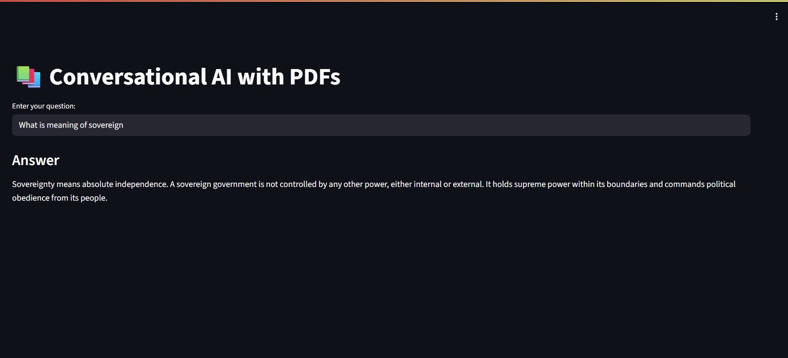

# Conversational AI with PDF Question Answering, Summarization & Chat

This project is a **LangChain-powered Conversational AI** that can:
- **Answer questions** from PDFs using semantic search.
- **Summarize** document contents.
- **Engage in free-form conversation** with memory of the last few interactions.

It uses **Google Generative AI (Gemini)** for language understanding and embeddings, with **FAISS** as a local vector database.

**Modes** - select mode in config file or let the LLM choose

## Running CMD
```bash
python main.py
```

## 🚀 Running the App

### 1. Streamlit Interface

Run the Streamlit app:
```bash
streamlit run app.py
```



## 📂 Folder Structure

```plaintext
├── pdf_files/             # Place your PDFs here
├── config.yaml            # Configuration file (vector DB name, etc.)
├── .env                   # API keys & secrets
├── main.py                # Main entry point for the app
├── requirements.txt       # Python dependencies
└── README.md              # This file


